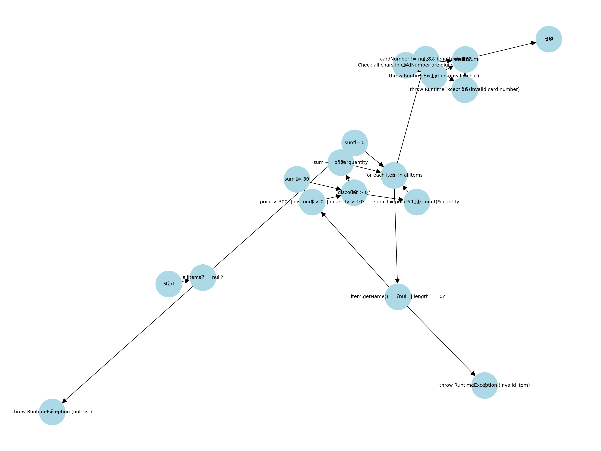

# Христијан Чаушоски - 173145

## Software Testing - Laboratory Exercise 2

### Task Description

- Write **unit tests** for the `checkCart` method in the `SI_lab2` class.
- Draw the **Control Flow Graph (CFG)**.
- Calculate the **Cyclomatic Complexity**.
- Identify **independent paths**.

---

### Unit Tests

Implemented using **JUnit** in the `SI_lab2Test` class.

---

### Cyclomatic Complexity

- **Cyclomatic Complexity (M)** = E - N + 2P
- Where:
  - E = number of edges
  - N = number of nodes
  - P = number of connected components (usually 1)
- M = *[your calculation here]*

---

### Control Flow Graph

---

### Independent Paths

1. Path 1: `...`  
2. Path 2: `...`  
3. Path 3: `...`  
4. Path 4: `...`

---

